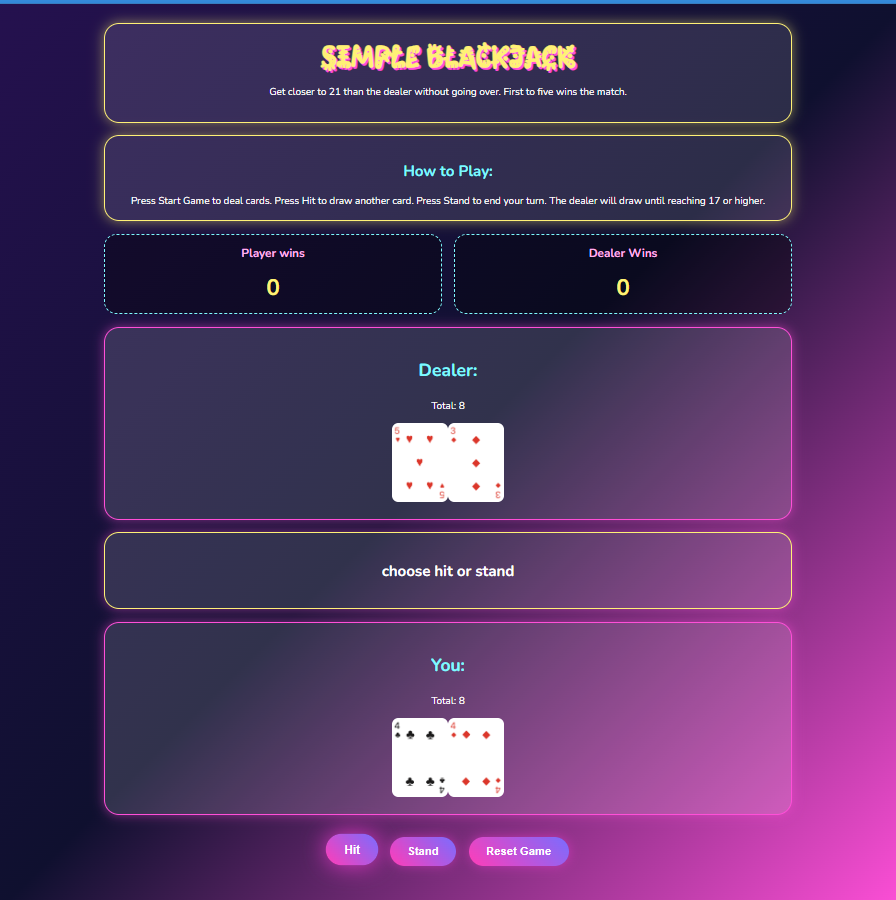
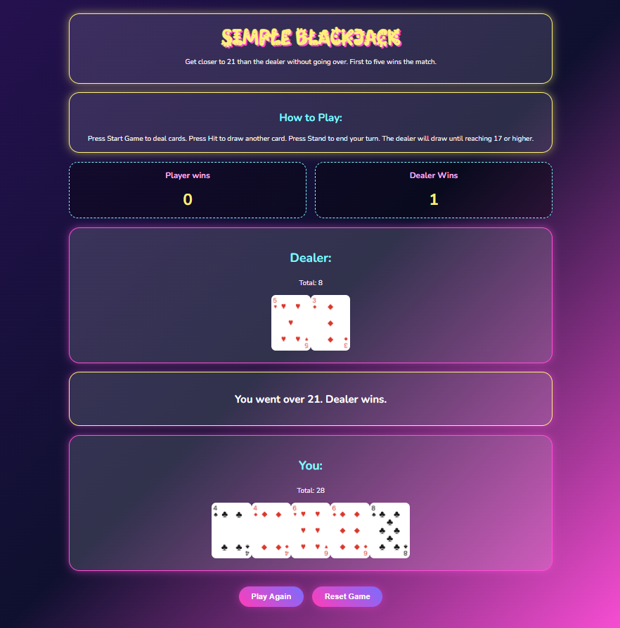

# Blackjack 🎪🃏

A browser-based Blackjack game where the player competes against the dealer. The goal is to get closer to 21 without going over. The first side to reach 5 round wins wins the full game.

[Screenshots]

## Getting Started

### Play the Game

[Deployed Game Link]

`https://alialaliwat21.github.io/Project1-game/`

### How to Play

1. Press **Start Game** to deal cards.
2. Press **Hit** to draw another card.
3. Press **Stand** to end your turn.
4. The dealer draws until reaching 17 or higher.
5. Whoever is closer to 21 without going over wins the round.
6. The first to reach **5 wins** wins the full game.
7. Press **Play Again** to start another round.
8. Press **Reset Game** to reset the full match.

### Technologies Used

- **HTML**
- **CSS**
- **JavaScript**

### Future Enhancements

- Add smarter Ace logic where Ace can count as 1 or 11.
- Prevent duplicate cards from being drawn in the same round.
- Add more sound effects and animations.
- Add hidden dealer card until the player stands.
- Implement the option of allowing multiple players to join the game.
- Enhance the game's visual experience by adding polished animations and improving the user interface.

### Credits

- Playing card image assets from: 
`https://github.com/hanhaechi/playing-cards`
- Sound effect from: 
`https://pixabay.com/sound-effects/search/card/`
- Thanks to my instructor and IAs for support and feedback.